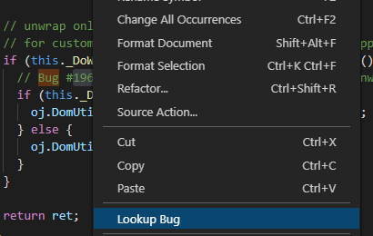

# bk-lookup README

This extension is useful in invoking a browser to lookup a bug or issue in seen in code.  You can configure the search string to correspond to whatever project you are working, and the appropriate url for your bug tracking system.

## Features

Right-click on a bug number in your source. Select "Lookup Bug".  A browser is brought up to your bug tracking system and show the related bug.  If it's a JIRA issue, select the entire JIRA text (JIRA-123), right click, and it brings up the browser to your JIRA isue.

There are 3 search bug engines installed:  oracle, google, mozilla.
The google and mozilla ones are publically available.  The oracle one is internal only and default, so will not work for non-Oracle employees.  You can select which to use by user setting json on top level: "bugdb.source": "oracle" or "google" or "mozilla" .  If you want to user your own internal company db, you can set "oracleBugdb.url": "your internal url search".

The oracle one also shows how to use 2 internal sites, if the selected string starts with JIRA, it invokes
the JIRA oracle site, otherwise the bugdb site.  

## Requirements

For the oracle search engine, you must be inside oracle corporations network.  For google and mozilla, no restrictions.

## Extension Settings

This extension contributes the following settings:

* `bugdb.source`: select which bugdb to use, 'oracle','google', 'mozilla'

## Known Issues

## Release Notes

### 1.0.0

Initial release of bk-lookup.

